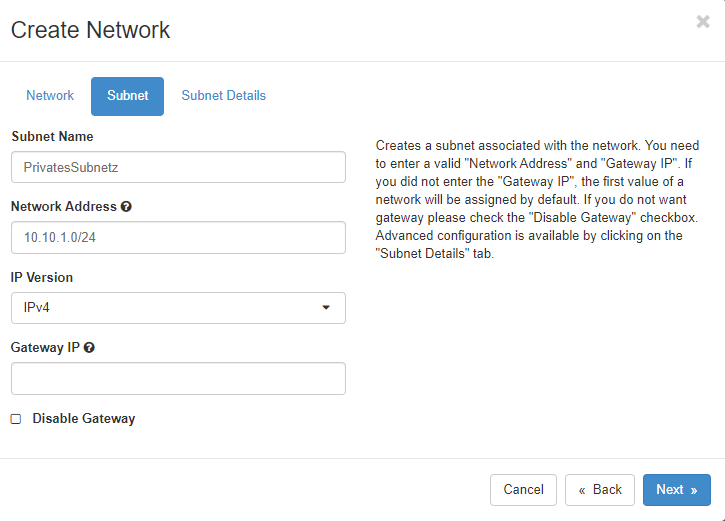
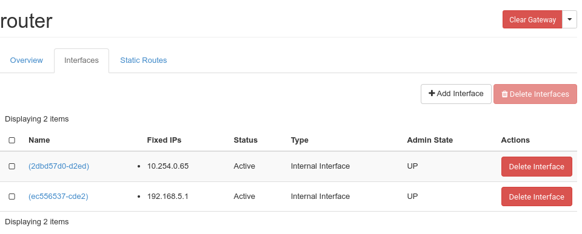
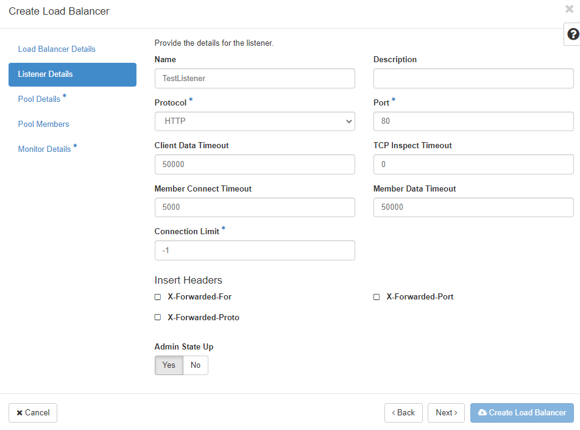

---
title: "Netzwerke, Load Balancer, Floating IPs und Sicherheitsgruppen"
type: "docs"
weight: 50
date: 2023-02-24
description: >
  Netzwerke erstellen, Load Balancer, Floating IPs und Sicherheitsgruppen verwenden

## Vernetzung
Um Ihnen die Arbeit zu erleichtern, werden neue Projekte in der pluscloud open mit einem vorkonfigurierten Netzwerk-Setup erstellt, welches ein privates Netzwerk und einen Router enthält, der dieses private Netzwerk mit dem Internet verbindet. Die gesamte Netzwerkkonfiguration in Horizon wird über das Menü "Netzwerk" vorgenommen.


"**Netzwerktopologie**" zeigt Ihnen ein Diagramm Ihrer aktuellen Netzwerkumgebung. "**Netzwerke**" listet alle derzeit konfigurierten Netzwerke in Ihrem Projekt auf und ermöglicht es Ihnen, bestehende Netzwerke zu verwalten, zu löschen und neue Netzwerke zu erstellen. "**Router**" listet alle konfigurierten Router in Ihrem Projekt auf und ermöglicht die Verwaltung, Erstellung und Löschung von Routern. "**Sicherheitsgruppen**" sind im Grunde Firewall-Regeln, mit denen Sie den Datenverkehr zu oder von Ihrer Infrastruktur zulassen oder verweigern können. Mit "**Load Balancers**" können Sie Load Balancer, Member und Pools in Ihrer Umgebung erstellen, löschen und verwalten. Mit "**Floating IPs**" können Sie öffentliche IP-Adressen für Ihre Instanzen verwalten, anhängen, abhängen und allozieren.

### Netzwerktopologie
Im Menüpunkt "Netzwerktopologie" können Sie sich einen Überblick über das Netzwerk-Setup in Ihrem Projekt verschaffen. Das Diagramm zeigt Ihre aktuelle Konfiguration und wird bei jeder Änderung der Umgebung aktualisiert.


Das obige Diagramm zeigt zwei private Netzwerke, die über zwei Router mit einem öffentlichen Netzwerk ("Providernetzwerk" in der OpenStack-Sprache) verbunden sind. Wenn Sie mit der Maus über die Elemente des Diagramms fahren, werden weitere Informationen und Verknüpfungen zu anderen Funktionen der Web-GUI angezeigt.

### Netzwerk Policies

#### Überblick

In OpenStack werden Netzwerk-Policies implementiert, um die Datenübertragungsraten von virtuellen Netzwerkschnittstellen innerhalb der Cloud-Umgebung zu verwalten und zu kontrollieren. Diese Policies sind entscheidend für die Gewährleistung einer fairen Nutzung, die Vermeidung von Netzwerküberlastungen und die Aufrechterhaltung einer optimalen Leistung über mehrere Mandanten und Arbeitslasten hinweg.

Standardmäßig wird allen neu erstellten Netzwerken eine Bandbreitenbegrenzung von 1 Gbit/s zugewiesen. Diese Standardpolicy stellt sicher, dass die Netzwerkleistung für allgemeine Arbeitslasten optimiert wird, während gleichzeitig verhindert wird, dass ein einzelner Tenant oder eine einzelne Instanz die Netzwerkressourcen monopolisiert.

Für Kunden mit höheren Leistungsanforderungen bietet pluscloud open alternative Bandbreiten-Policies mit höheren Limits. Diese Policies ermöglichen einen höheren Datendurchsatz, der für anspruchsvollere Anwendungen wie datenintensive Analysen, Media-Streaming oder High-Performance-Computing notwendig sein kann.

Hier ist eine Übersicht:

| Name der Policy            | Durchsatz | Anwendungsfall                                                                                                                                                              |
|----------------------------|-----------|-----------------------------------------------------------------------------------------------------------------------------------------------------------------------------|
| standard-throughput-policy | 1 Gbit/s  | Geeignet für Standard-Workloads, die keine hohen Datenübertragungsraten erfordern, und bietet eine ausgewogene Mischung aus Leistung und Kosteneffizienz.                   |
| high-throughput-policy     | 2 Gbit/s  | Ideal für moderate Arbeitslasten, die eine höhere Netzwerkleistung erfordern, wie z. B. Echtzeit-Datenverarbeitung oder Anwendungen mit erhöhten Verkehrsanforderungen.     |
| premium-throughput-policy  | 4 Gbit/s  | Konzipiert für leistungskritische Anwendungen, z. B. große verteilte Systeme, High-Definition-Video-Streaming oder Workloads mit hohen Anforderungen an den Datendurchsatz. |

{}
Derzeit können Kunden von den Policies für höhere Bandbreiten (2 Gbit/s und 4 Gbit/s) profitieren, ohne dass ihnen zusätzliche Kosten entstehen. Dies kann sich jedoch in Zukunft ändern. Preisanpassungen sind zu erwarten. Wir empfehlen, künftige Mitteilungen auf Aktualisierungen der Preise zu überprüfen.
{}

#### Anwendung von Policies

Netzwerk Policies werden zum Zeitpunkt der Netzwerkerstellung automatisch angewendet. Die Standardgrenze von 1 Gbit/s wird zugewiesen, sofern nicht ausdrücklich eine andere Bandbreitengrenze konfiguriert wurde. Kunden können die Policy über die Openstack-CLI-Schnittstelle ändern:

```
openstack network set --qos-policy high-throughput-policy your-network
```

{}
Die Policies können nur über die Openstack-CLI-Schnittstelle geändert werden.
{}

### Netzwerke verwalten
Unter "Netzwerke" finden Sie die konfigurierten Netzwerke in Ihrer Umgebung und Sie können Netzwerke verwalten, hinzufügen oder löschen.


Jedes Netzwerk benötigt ein zugehöriges Subnetz, das ebenfalls bei der Erstellung des Netzwerks eingerichtet wird. Das externe Netzwerk - "ext01" Fall der pluscloud open - wird vom Provider konfiguriert und kann nicht geändert werden.

#### Netzwerke erstellen
Mit einem Klick auf "Netzwerk erstellen" öffnet sich ein Dialog, um ein neues Netzwerk zu definieren.


Sie müssen dem neuen Netzwerk einen Namen geben, entscheiden, ob es Datenverkehr empfangen soll (indem Sie auf "**Enable Admin State**" klicken) und entscheiden, ob Sie ein neues Subnetz im neuen Netzwerk erstellen oder ein bestehendes verwenden wollen. Die "**Availability Zone Hints**" beziehen sich derzeit auf die gesamte pluscloud-open-Umgebung, da es nur eine Availability Zone pro pluscloud-open-Umgebung gibt.

Wenn Sie "Subnetz erstellen" gewählt haben, müssen Sie im nächsten Schritt das Subnetz definieren.



Hier erstellen Sie ein Subnetz, das mit dem neuen Netzwerk verbunden ist. Sie benötigen eine gültige "Netzwerkadresse" eines [RFC1918](https://www.rfc-editor.org/rfc/rfc1918)-Netzwerks in [CIDR](https://en.wikipedia.org/wiki/Classless_Inter-Domain_Routing)-Notation. Wenn Sie keine "Gateway-IP" angeben, wird die erste IP-Adresse des Teilnetzes automatisch zur Gateway-IP-Adresse. Wenn Sie kein Gateway in Ihrem Netzwerk haben wollen, klicken Sie auf "Gateway deaktivieren".

Eine detaillierte Konfiguration des Subnetzes finden Sie im Menü "Subnetzdetails".


Hier können Sie festlegen, ob [DHCP](https://en.wikipedia.org/wiki/Dynamic_Host_Configuration_Protocol) im Subnetz verfügbar sein soll. Wenn Sie möchten, können Sie außerdem den Subnetzpool angeben, aus dem DHCP-Adressen zugewiesen werden sollen. Zuteilungspools sollten mindestens mit der Adresse .5 beginnen, da auf diesen ersten Adressen des Netzes bereits andere Netzwerkdienste laufen könnten.
Wenn Sie bestimmte Nameserver für Ihr Netzwerk verwenden möchten, können Sie diese im Feld "DNS-Nameserver" definieren. Spezifische Host-Routen zu bestimmten Netzwerken können Sie im Feld "Host-Routen" einstellen, wo Sie das Zielnetzwerk in CIDR-Notation definieren, gefolgt von der Gateway-IP-Adresse, über die Sie das Zielnetzwerk erreichen können.
Klicken Sie auf "Erstellen", damit OpenStack das neue Netzwerk und Subnetz bereitstellt.

### Router
Netzwerke müssen durch Router verbunden werden, um kommunizieren zu können. Dies gilt sowohl für externe Netzwerke als auch für interne Netzwerke.
Das Menü "Router" listet alle konfigurierten Router auf, erlaubt die Verwaltung und das Löschen dieser Router sowie das Anlegen neuer Router.


### Router erstellen
Um einen neuen Router zu erstellen, klicken Sie auf "Create Router", geben Sie ihm einen Namen, erlauben Sie ihm, Pakete zu routen, indem Sie auf "Enable Admin State" klicken und wählen Sie ein "External Network" aus der Liste.


### Schnittstelle hinzufügen
Wenn Sie auf den Namen eines bereits vorhandenen Routers klicken, sehen Sie die aktuellen Schnittstellen und deren Konfiguration



Wenn Sie auf "Schnittstelle hinzufügen" klicken, können Sie auswählen, mit welchem Subnetz die Route verbunden werden soll und welche IP-Adresse die neue Router-Schnittstelle erhalten soll.


### Statische Route hinzufügen

Mit einem Klick auf den Reiter "Statische Routen" können Sie Ihrem Router statische Routen hinzufügen


Fügen Sie das Zielnetz in CIDR-Notation hinzu und definieren Sie eine erreichbare IP-Adresse für den Router, um eine Verbindung zum Zielnetz herzustellen.

## Sicherheitsgruppen
Ein sehr wichtiger Teil der Netzwerkumgebung Ihres Projekts sind die Sicherheitsgruppen, die wie Firewall-Regelsätze funktionieren, um den Datenverkehr zu Ihren Instanzen zuzulassen oder zu verbieten. Nur erwünschter Datenverkehr sollte Ihre Instanzen erreichen können.

Standardmäßig ist eine "Standard-Sicherheitsgruppe" für Instanzen aktiv, denen keine anderen Sicherheitsgruppen zugewiesen sind. Diese Gruppe enthält eine Reihe von Regeln für ein- und ausgehenden Datenverkehr. Diese Gruppe wird normalerweise neuen Instanzen zugewiesen, um SSH-Anmeldungen zu ermöglichen.


"Egress" ist für ausgehenden Traffic. Jeder Traffic (einschließlich ICMP) ist für IPv4 und IPv6 erlaubt. "Ingress" oder eingehender Traffic ist für ICMP sowie SSH (Port 22) erlaubt. Regeln, die die "Remote Security Group" "default" definiert haben, werden verwendet, um sicherzustellen, dass jede Quellinstanz jede andere Zielinstanz in dieser "default" Gruppe über IPv4 und IPv6 erreichen kann.
Denken Sie daran, dass die Sicherheitsgruppen jeder Instanz einzeln zugewiesen werden müssen. Diese gelten nicht für Ihre gesamte Umgebung.

### Sicherheitsgruppe erstellen

Wenn Sie auf "+Sicherheitsgruppe erstellen" klicken, wird eine neue Sicherheitsgruppe erstellt und Sie gelangen zu einem neuen Menü, in dem Sie neue Sicherheitsregeln zu Ihrer neuen Sicherheitsgruppe hinzufügen können. Es gibt eine Reihe von vordefinierten Regeln für verschiedene Protokolle. Sie können "Custom TCP/UDP/ICMP"-Regeln für einzelne Ports definieren.
Sie sollten das Beschreibungsfeld verwenden, um einen einfachen Überblick darüber zu erhalten, was jede Regel tun soll. Definieren Sie außerdem die Richtung des Datenverkehrs (Ausgang/Eingang) sowie den Netzwerkport, für den die Regel gelten soll. Sie können einen einzelnen Port, mehrere Ports oder einen Portbereich definieren. Für ICMP-Traffic legen Sie ICMP-Typ und -Code fest.


"Remote" beschreibt Quelle oder Ziel - je nachdem, ob es eine Ingress- oder eine Egress-Regel werden soll. Sie können hier eine IP-Adresse (in CIDR-Notation) oder eine andere Sicherheitsgruppe definieren.

## Load Balancer

Das Menü "Load Balancers" ermöglicht es Ihnen, Load-Balancing-Dienste zu definieren. Ein Klick auf "Load Balancers" zeigt eine Seite mit allen bereits definierten Load Balancern. Diese können hier verwaltet oder gelöscht werden. Und Sie können neue hinzufügen, indem Sie auf "+Loadbalancer erstellen" klicken.
Um einen neuen Loadbalancer zu erstellen, müssen Sie verschiedene Parameter festlegen. Sie werden durch einige Menüs geführt und sobald Sie genügend Informationen eingegeben haben, wird die Schaltfläche "Load Balancer erstellen" aktiviert und Sie können den Erstellungsprozess starten. Sternchen kennzeichnen Felder, die ausgefüllt werden müssen, um einen Load Balancer zu erstellen.


"**Name**" und "**IP-Adresse**" sind die ersten beiden Informationen, die Sie eingeben müssen. Wählen Sie eine IP-Adresse aus Ihrem Subnetz. Wenn Sie dieses Feld leer lassen, wird eine IP-Adresse aus dem von Ihnen gewählten Subnetz zugewiesen (sofern DHCP dort aktiv ist).

"**Beschreibung**" ist optional, sollte aber verwendet werden, um Informationen über das "Warum" und "Was" dieser speziellen Load-Balancer-Instanz zu speichern. Sie können keinen "**Flavor**" wählen. Die pluscloud open verwendet hier das Amphora Flavor. Wie bereits erwähnt, müssen Sie ein "**Subnet**" auswählen, mit dem der Load Balancer verbunden werden soll. Mit "**Admin State Up**" kann man den Load-Balancer ausgeschaltet anlegen. Er muss auf "**Admin State Up**" geschaltet werden, um den Datenverkehr auszugleichen.


Das nächste Menü "Listener Details" definiert den Listener für den neuen Load Balancer:



Jeder einzelne Port des neuen Load Balancers, der Datenverkehr empfangen soll, wird separat konfiguriert und dem Load Balancer zugewiesen. Sie können mehrere Listener pro Load Balancer definieren, solange jeder einen anderen Port verwendet.

"**Protokoll**" definiert das Protokoll, das auf dem "**Port**" erwartet werden soll. Sie können "TERMINATED_HTTPS" nur dann als Protokoll wählen, wenn Sie den Schlüsselmanagerdienst (Barbican) aktiviert und konfiguriert haben. Die "**Port**"-Nummer sollte zwischen 1 und 65535 liegen.

Mit dem "**Client Date Timeout**" konfigurieren Sie, wie lange TCP-Verbindungen zu Clients aufrechterhalten werden dürfen, wenn der Client inaktiv ist. "**TCP Inspect Timeout**" ist die Zeit in Millisekunden, die der Load Balancer auf zusätzliche Inhalte wartet. Zeitüberschreitungen zu den Load-Balancer-Membern werden im Feld "**Member Connect Timeout**" konfiguriert. Im Feld "**Connection Limit**" können Sie die Anzahl der erlaubten Verbindungen auf den jeweiligen Listener begrenzen: "-1" bedeutet unbegrenzt. Wenn Sie HTTP-Header einfügen möchten, können Sie unter "**Header einfügen**" eine oder beide der unterstützten Optionen auswählen.

Als nächsten Schritt müssen Sie die "**Pool Details**" für den neuen Load Balancer definieren. Ein "Pool" ist eine Gruppe von Member-Instanzen, die den Verkehr über den Load Balancer erhalten sollen.


Zuerst definieren Sie den Load-Balancing-"**Algorithmus**":

    * LEAST_CONNECTIONS: sendet die nächste Anfrage an die Instanz mit der geringsten Anzahl von Verbindungen im Pool
    * ROUND_ROBIN: sendet Anfragen nach dem Zufallsprinzip an die nächste verfügbare Instanz des Pools
    * SOURCE_IP: sendet Anfragen von der gleichen Quell-IP-Adresse immer an die gleiche Instanz im Pool

Wenn Ihre Anwendung "**Session Persistence**" benötigt, können Sie die Methode hier auswählen:

    * SOURCE_IP: Die Quell-IP-Adresse wird als Persistenzmerkmal verwendet
    * HTTP_COOKIE: HTTP-Cookies, die von der Compute-Instanz im Pool gesetzt werden, werden als Persistenzmerkmal verwendet
    * APP_COOKIE: Ihre Anwendung verwendet/erzeugt ein benutzerdefiniertes Cookie, das Sie in das Feld "**Cookie Name**" eintragen müssen.

Die "**Pool Members**" für den neuen Load-Balancer-Pool werden im nächsten Menü definiert. Sie können aus den Instanzen in der Liste wählen:


Die Liste "**Verfügbare Instanzen**" enthält die für Ihren Pool in Frage kommenden Instanzen. Klicken Sie auf "Hinzufügen", um sie dem Pool hinzuzufügen. Klicken Sie auf "Externe Member hinzufügen", um Member hinzuzufügen, die nicht in der Liste angezeigt werden.

Die "**IP-Adresse**" ist die IP-Adresse der Netzwerkschnittstelle der Instanz, die den Verkehr vom Load Balancer empfangen soll. IPv4- und IPv6-Adressen sind erlaubt. Das "**Subnetz**" sollte das Subnetz sein, das die IP-Adresse des Members enthält. Der "**Port**" sollte der TCP-Port sein, auf dem der Member den Verkehr vom Load Balancer empfangen soll. Das "**Gewicht**" definiert die relative Anzahl der Anfragen, die das jeweilige Member im Verhältnis zu den anderen Membern erhalten soll. Erlaubte Werte liegen zwischen 1 und 256.
Wenn Sie auf den Pfeil klicken, können Sie noch weitere Pool-Details wie "**Überwachungsadresse**" und "**Überwachungsport**" definieren - wenn Sie eine Überwachungsadresse definieren möchten, die vom Dienst (IP-Adresse und Port) auf Ihrer Instanz getrennt ist. Lassen Sie sie unverändert, um die IP-Adresse und den Port des Members für die Überwachung zu verwenden.
Wenn Sie ein "**Backup**" oder Failover-Member in Ihrem neuen Pool definieren wollen, das nur verwendet wird, wenn alle anderen Member nicht erreichbar sind, klicken Sie hier auf "Ja".

Der letzte Schritt ist das Menü "**Monitor Details**". Die Überwachung dient dazu, den Zustand der Pool-Member zu ermitteln. Sogenannte "Health Checks" werden für alle Member des Pools durchgeführt und bestimmen, ob der geprüfte Member Traffic vom Load Balancer erhält. Schlägt der Health Check fehl, erhält der Member keinen Datenverkehr. Jeder Pool kann seinen eigenen Health Check haben, der für alle Member des Pools verwendet wird.


Sie können einen Monitor-"**Typ**" aus der Liste von HTTP, HTTPS, PING, TCP, TLS-HELLO, UDP-CONNECT und SCTP auswählen. Je nach Auswahl müssen Sie verschiedene Informationen eingeben.
Die "**Verzögerung (sec)**" bestimmt die Zeit zwischen den Health Checks. Sie sollte so groß wie "**Timeout**" oder größer sein. Mit "**Max Retries**" können Sie festlegen, wie oft der Load Balancer versuchen soll, den Health Check durchzuführen, bevor er den Status des Members auf **inaktiv** setzt (sollte eine Zahl zwischen 1 und 10 sein). "**Max Retries Down**" ist die Anzahl der erlaubten Verbindungsabbrüche, bevor der Pool-Member als "**faulty**" deklariert wird (wieder eine Zahl zwischen 1 und 10). Der "**Timeout**" beschreibt die Zeit, die ein Healtch Check maximal dauern darf, um als erfolgreich zu gelten (sollte eine Zahl größer oder gleich 0 und kleiner oder gleich "**Delay (sec)**" sein).
Die "**HTTP-Methode**" kann eine der erlaubten HTTP-Methoden sein (wie GET, HEAD, etc.) und "**Erwartete Codes**" sollte ein HTTP-Code (oder eine Liste dieser) sein, der bei einer erfolgreichen Überprüfung zurückgegeben wird.
Unter "**URL Path**" kann ein benutzerdefinierter Pfad für Ihre Health Checks angegeben werden. Denken Sie daran, dass dieser vom Monitor alle "**Verzögerung (Sek)**" abgefragt wird.
Wenn alle erforderlichen Informationen in die Formulare eingegeben wurden, kann der Load Balancer erstellt werden. Wenn Sie möchten, dass der Load Balancer vom öffentlichen Internet aus erreichbar ist, müssen Sie ihm eine Floating IP-Adresse zuweisen.

## Floating IPs

Über das Menü "**Floating IPs**" können Sie öffentliche IP-Adressen in Ihrem Projekt auflisten und verwalten. Freie IP-Adressen müssen zugewiesen werden, bevor sie mit einem Dienst verknüpft werden können. Sie können auch von einem Dienst getrennt werden, damit dieser nicht mehr aus dem Internet erreichbar ist.


Sie können Floating-IP-Adressen mit Instanzen und Load Balancern verknüpfen. Achten Sie auf die Dienste, die aus dem Internet erreichbar sein sollen und konfigurieren Sie Ihre Sicherheitsgruppen entsprechend. Floating-IP-Adressen werden abgerechnet und in Rechnung gestellt, solange sie reserviert sind - unabhängig davon, ob sie einem Dienst zugeordnet sind oder nicht.
