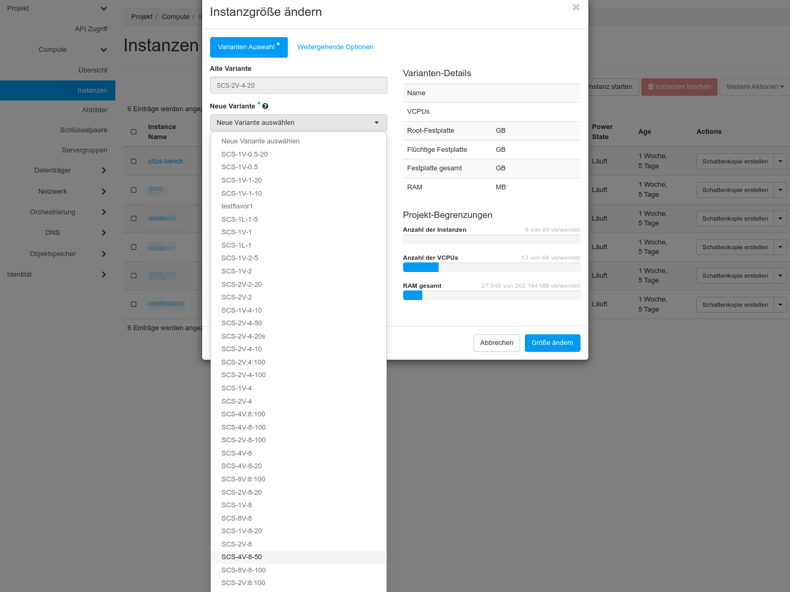

---
#https://gohugo.io/content-management/page-bundles/
title: "Instanzgröße ändern"
type: "docs"
weight: 1
date: 2024-07-30
description: >
  Ändern Sie die Dimensionen Ihrer VMs
---

## Überblick

Es kann vorkommen, dass die Änderung der CPU-, Memory- oder Storage-Ausstattung einer VM notwendig wird. Möglicherweise hat man sich bei der Erstellung der VM verschätzt oder man möchte die Leistung einer Applikation mit verschiedenen CPU- oder RAM-Ausstattungen ermitteln.
Anstatt die VM komplett neu zu erstellen zu müssen, kann stattdessen das Flavor geändert werden. Die Instanz wird gestoppt und mit dem neuen Flavor neu gestartet.
In der [Openstack-Dokumentation](https://docs.openstack.org/nova/latest//user/resize.html) finden sich weitere Hinweise.

## Instanzgröße in der Web UI ändern

Um die Instanzgröße zu ändern, wählen Sie die entsprechende Funktion im "**Actions**" Menü der Instanzübersicht aus:

Im Dialog, der sich danach öffnet, wählen Sie einfach ein neues Flavor für ihre VM aus:

Nach der Auswahl zeigt der Dialog die neu ausgewählten Parameter sowie die Auswirkungen auf das aktuelle Quota des Projektes an:

Mit Klick auf "**Größe ändern**" wird der neue Flavor auf die Instanz angewendet. Dazu wird die Instanz gestoppt und neu gestartet. Weiterhin muß die Größenänderung noch bestätigt werden.

Mit Klick auf "**Größenänderung/Migration bestätigen**" bestätigen Sie die Änderung. Mit "**Größenänderung/Migration zurücknehmen**" könnten Sie die Änderung auch hier wieder zurücknehmen.

Die VM steht Ihnen nach dem Start mit den neuen Parametern zur Verfügung.

## Instanzgröße mit dem Openstack Client ändern

Das Ändern der Instanzgröße mit dem Openstack Client verläuft genauso wie bei der Änderung über die Web UI. Nehmen wir an, wir hätten eine Instanz mit der folgenden Größe erzeugt:

    (openstack-client) debian@test:~$ openstack server show zuklein --format json | jq .flavor
    {
      "name": "SCS-1V-2",
      "original_name": "SCS-1V-2",
      "description": null,
      "disk": 0,
      "is_public": true,
      "ram": 2048,
      "vcpus": 1,
      "swap": 0,
      "ephemeral": 0,
      "is_disabled": null,
      "rxtx_factor": null,
      "extra_specs": {
        "aggregate_instance_extra_specs:ceph": "true",
        "hw_rng:allowed": "True",
        "quota:disk_read_bytes_sec": "256000000",
        "quota:disk_read_iops_sec": "2500",
        "quota:disk_write_bytes_sec": "256000000",
        "quota:disk_write_iops_sec": "2500",
        "scs:cpu-type": "shared-core",
        "scs:name-v1": "SCS-1V:2",
        "scs:name-v2": "SCS-1V-2"
      },
      "id": "SCS-1V-2",
      "location": null
    }

Und wir würden entscheiden, dass wir die Instanz mit einem Flavor mit mehr vCPUs und mehr Arbeitsspeicher vergrößern möchten. Dann würden wir folgenden Befehl ausführen:

    (openstack-client) debian@test:~$ openstack server resize --flavor SCS-2V-4 zuklein
    (openstack-client) debian@test:~$ openstack server list |grep zuklein
    | 433ee1e1-5928-4453-8e09-fd3ec0ccd618 | zuklein                                                    | RESIZE | mynetwork=10.8.0.178                | N/A (booted from volume)  | SCS-2V-4          |

Das Kommando kommt ohne Fehlermeldung zurück und die Instanz ändert ihren Status nach 'RESIZE'. Sobald der Prozess der Vergrösserung beendet ist, ändert die Instanz ihren Status nach 'VERIFY_RESIZE':

    (openstack-client) debian@test:~$ openstack server list |grep zuklein
    | 433ee1e1-5928-4453-8e09-fd3ec0ccd618 | zuklein                                                    | VERIFY_RESIZE | mynetwork=10.8.0.178                | N/A (booted from volume)  | SCS-2V-4          |

Wenn der Prozess ohne Fehler verlaufen ist, muß die Vergrößerung noch bestätigt werden:

    (openstack-client) debian@test:~$ openstack server resize confirm zuklein
    (openstack-client) debian@test:~$ openstack server list |grep zuklein
    | 433ee1e1-5928-4453-8e09-fd3ec0ccd618 | zuklein                                                    | ACTIVE | mynetwork=10.8.0.178                | N/A (booted from volume)  | SCS-2V-4          |

Und die Instanz wechselt ihren Status wieder nach 'ACTIVE'. Wenn es eine Fehlermeldung bei der Vergrößerung gegeben hat, kann man die Instanz auf das alte Flavor zurückschalten:

    (openstack-client) debian@test:~$ openstack server resize revert zuklein

Dies sollte den Instanzstatus ebenfalls nach 'ACTIVE' ändern - allerdings mit dem alten Flavor.

---
**Hinweis**

Es ist nicht möglich, durch eine Größenanpassung die Storageklasse einer VM zu wechseln. Es ist also z. B. nicht möglich durch den Wechsel des Flavors von SCS-2V-4-20 auf SCS-2V-4-20s von Ceph-Storage nach Local-SSD Storage zu wechseln.

---
