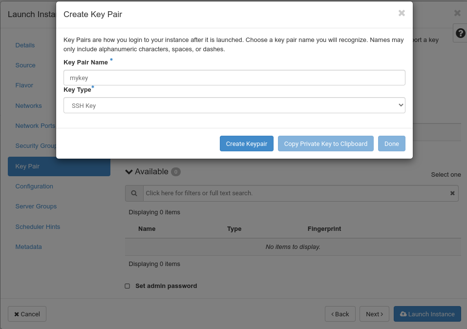
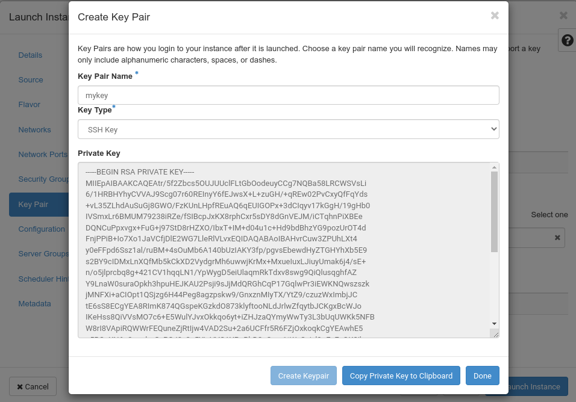
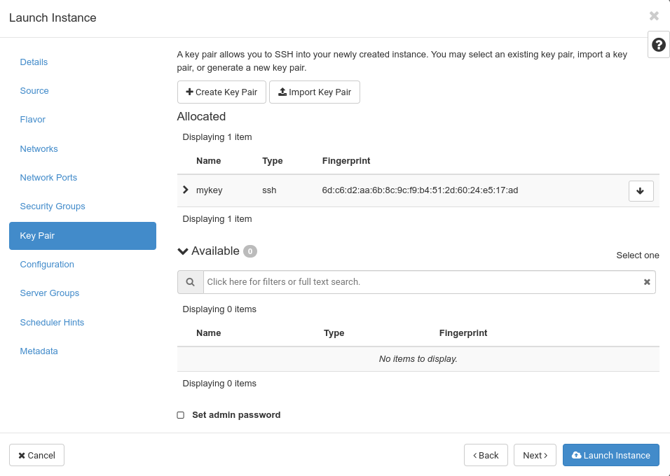
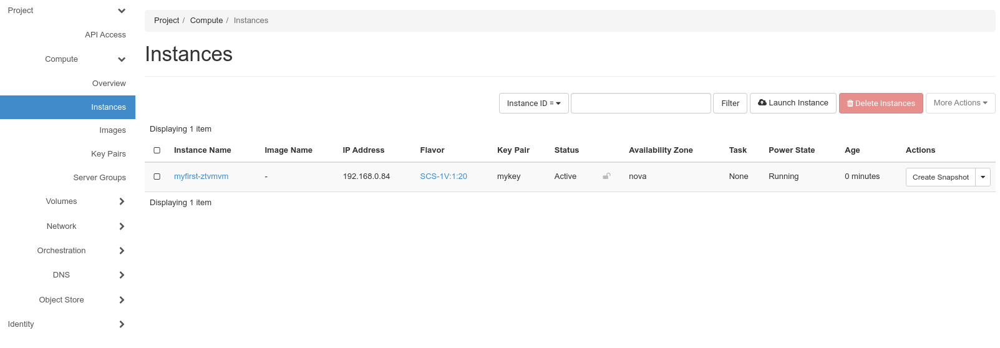

---
#https://gohugo.io/content-management/page-bundles/
title: "Von Null bis zum ersten Login in eine VM mit Horizon"
type: "docs"
date: 2023-03-20
description: >
  Bauen Sie sich Ihre erste VM in Horizon und melden Sie sich an
---

## Ihre Anmeldedaten 

Nachdem Sie eine pluscloud open in einer unserer Regionen bestellt haben, erhalten Sie eine E-Mail ähnlich der folgenden:

    Liebe Kundin, lieber Kunde,
    
    Ihre pluscloudopen d123456 ist nun verfügbar unter https://prod1.api.pco.get-cloud.io/
    Zugangsdaten:REGION=prod1
    DOMAIN_NAME=d123456
    PROJECT_NAME=p123456-ztvm
    USERNAME=u123456-projectadm
    PWX_LINK=https://pwx.psmanaged.com/link/agp4513256
    Mit freundlichen Grüßen,
    Ihr pluscloudopen Team.

Diese E-Mail enthält alle Informationen, die Sie benötigen, um sich zum ersten Mal mit Ihrer pluscloud open zu verbinden.

Wenn Sie auf ``https://prod1.api.pco.get-cloud.io/`` klicken, öffnet sich ein neuer Tab in Ihrem Browser und Sie gelangen zur Login-Maske der pluscloud open.

Hier benötigen Sie die Informationen aus der E-Mail. Sie erhalten Ihr "**Passwort**", indem Sie auf den "PWX_LINK" klicken. Dieser führt Sie zu einer Webseite mit einem weiteren Link, den Sie anklicken müssen, um das Passwort für Ihren Benutzer schließlich zu erhalten. Auf diese Weise umgehen wir Antiviren-Software, die Links in Ihren E-Mails erkennt und einen Passwort-Link ungültig machen würde. 

Geben Sie den "USERNAME" aus der E-Mail in das Feld "**Benutzername**" ein, verwenden Sie das Passwort aus dem "PWX_LINK" für das Feld "**Passwort**" und den "DOMAIN_NAME" für das Feld "**Domain**".

Nachdem Sie auf "**Anmelden**" geklickt haben, sollten Sie die Web-GUI der pluscloud open sehen:

## Ihre erste Instanz

Um Ihre erste Instanz auf der pluscloud open zu starten, klicken Sie auf "**Instanzen**". Das führt Sie zum Menü "Instanzen":

Wie Sie sehen können, sind derzeit noch keine Instanzen eingerichtet. Um Ihre erste Instanz zu starten, klicken Sie auf "**Instanz starten**" in der oberen rechten Ecke. 
Daraufhin öffnet sich ein Pop-up, das Sie durch alle erforderlichen Schritte zum Erstellen und Starten einer neuen Instanz führt.

Sternchen (*) markieren erforderliche Informationen, daher müssen Sie Ihrer ersten Instanz einen Namen geben. Geben Sie ihn in das Feld "**Instanzname**" ein und klicken Sie auf "Weiter".

Sie müssen das "**Quell**"-Image Ihrer neuen Instanz aus der Liste der Images auswählen.

Wählen Sie das Image "**Ubuntu 22.04**" aus, indem Sie auf den kleinen nach oben gerichteten Pfeil am Ende der Zeile klicken. Anschließend wird das Image nun unter "Allocated" aufgelistet:

Scrollen Sie bis zum Ende der Liste und klicken Sie erneut auf "Weiter".

Sie befinden sich nun im Menü "**Flavor**", wo Sie einen Flavor für die Größe Ihrer neuen Instanz auswählen müssen. Wählen Sie die Variante "**SCS-1V:1:20**", indem Sie auf den kleinen nach oben gerichteten Pfeil am Ende der Zeile klicken.

Der gewählte Flavor sollte nun unter "Allocated" aufgelistet sein:

Wie Sie sehen, ist der Button "**Instanz starten**" jetzt anklickbar:

Bevor Sie jedoch die Instanz starten, klicken Sie bitte zuerst auf "**Key Pair**", was Sie zum Schlüsselpaar-Menü bringt.

Um sich nach dem Start der neuen Instanz über SSH anmelden zu können, benötigen Sie ein SSH-Schlüsselpaar (öffentlich/privat). Klicken Sie auf "Schlüsselpaar erstellen".

Benennen Sie Ihren neuen Schlüssel, indem Sie einen Namen in "**Schlüsselpaar-Name**" eingeben und "SSH-Schlüssel" als "**Schlüsseltyp**" wählen, dann klicken Sie auf "Schlüsselpaar erstellen":

Es erscheint ein neues Feld, das den "**Privaten Schlüssel**" des neu erzeugten Schlüsselpaares anzeigt. Klicken Sie auf "**Privaten Schlüssel in die Zwischenablage kopieren**", öffnen Sie Ihren bevorzugten Texteditor, fügen Sie den privaten Schlüssel aus der Zwischenablage in diesen ein und speichern Sie ihn auf Ihrer lokalen Festplatte. Auf einem Linux-System würden Sie beispielsweise den Vi-Editor öffnen, den Schlüssel dort einfügen und die neue Datei in Ihrem Home-Verzeichnis speichern. Auf einem Windows-System könnten Sie Ultraedit verwenden und die neue Datei ebenfalls in Ihrem Home-Verzeichnis speichern.

Nachdem Sie den privaten Schlüssel auf Ihrer Festplatte gespeichert haben, klicken Sie auf "Done". Der neue Schlüssel sollte nun unter "Allocated" aufgelistet sein:

Starten Sie nun die Instanz, indem Sie auf "**Instanz starten**" klicken. Das Menü "**Instanzen**" öffnet sich und zeigt die neu erstellte Instanz an.

Da Sie sich bei Ihrer neuen Instanz anmelden möchten, müssen Sie ihr eine öffentliche IP-Adresse zuweisen. Klicken Sie dazu auf den kleinen nach unten gerichteten Pfeil unter dem Menü "**Aktionen**".

Wählen Sie "**Associate Floating IP**", wodurch sich der entsprechende Dialog öffnet:

Da Sie bisher noch keine freie IP-Adresse zugewiesen haben, müssen Sie auf das kleine "+" im Feld "**IP-Adresse**" klicken, um eine IP-Adresse zuzuweisen.

Lassen Sie den Menüpunkt "**Pool**" unverändert und geben Sie eine "**Beschreibung**" in das entsprechende Feld ein. Klicken Sie dann auf "**IP zuweisen**".

Da Sie eine Floating IP-Adresse reserviert haben, können Sie nun auf "**Assign**" klicken, um diese mit Ihrer neuen Instanz zu verknüpfen:

Im Menü "**Instanzen**" sollte nun Ihre neu erstellte Instanz mit der soeben zugewiesenen, öffentlichen IP-Adresse angezeigt werden. Nun sollten Sie in der Lage sein, sich mit dieser neuen Instanz zu verbinden, indem Sie den privaten SSH-Schlüssel verwenden, den Sie zuvor erstellt haben.
Auf einem Linux-System müssen Sie zuerst die Berechtigungen der privaten Schlüsseldatei anpassen, die Sie zuvor gespeichert haben

    $ chmod 0600 /var/tmp/id.rsa.priv

Andernfalls würden Sie beim Versuch, den Schlüssel zu verwenden, eine Fehlermeldung über `bad permissions` erhalten. Nachdem Sie die Berechtigungen angepasst haben, sollten Sie in der Lage sein, sich einzuloggen:

    $ ssh -l ubuntu -i /var/tmp/id.rsa.priv 213.131.230.236
    Welcome to Ubuntu 22.04.2 LTS (GNU/Linux 5.15.0-67-generic x86_64)
    
     * Documentation:  https://help.ubuntu.com
     * Management:     https://landscape.canonical.com
     * Support:        https://ubuntu.com/advantage
    
      System information as of Mon Apr 24 14:56:26 UTC 2023
    
      System load:  0.1357421875      Processes:             92
      Usage of /:   7.5% of 19.20GB   Users logged in:       0
      Memory usage: 19%               IPv4 address for ens3: 192.168.0.84
      Swap usage:   0%
    
     * Introducing Expanded Security Maintenance for Applications.
       Receive updates to over 25,000 software packages with your
       Ubuntu Pro subscription. Free for personal use.
    
         https://ubuntu.com/pro
    
    Expanded Security Maintenance for Applications is not enabled.
    
    0 updates can be applied immediately.
    
    Enable ESM Apps to receive additional future security updates.
    See https://ubuntu.com/esm or run: sudo pro status
       
    
    The list of available updates is more than a week old.
    To check for new updates run: sudo apt update
    
    
    The programs included with the Ubuntu system are free software;
    the exact distribution terms for each program are described in the
    individual files in /usr/share/doc/*/copyright.
    
    Ubuntu comes with ABSOLUTELY NO WARRANTY, to the extent permitted by
    applicable law.
    
    To run a command as administrator (user "root"), use "sudo <command>".
    See "man sudo_root" for details.
    
    ubuntu@myfirst-ztvmvm:~$   

Herzlichen Glückwunsch! Sie haben gerade Ihre erste Instanz auf der pluscloud open erstellt und sich über SSH angemeldet.
