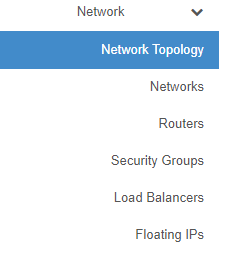
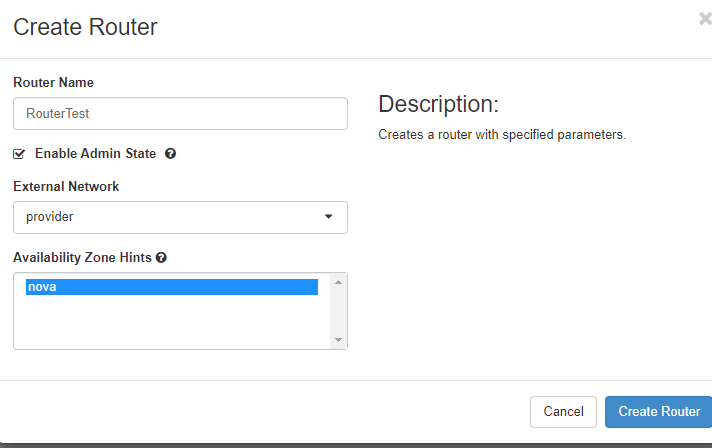
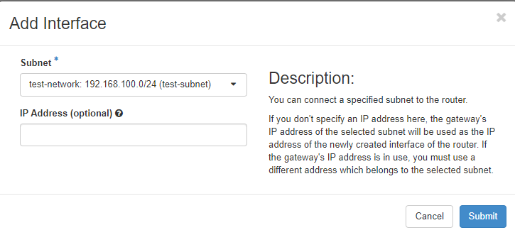

## Networking
For your convenience, new projects in pluscloud open are created with a preconfigured network setup that includes a private network and a router, which connects this private network to the internet. All network configuration in Horizon is done from the "Network" menu.



"**Network Topology**" provides a diagram of your current network setup. "**Networks**" lists all currently configured networks in your project and allows you to manage, delete or create networks. "**Routers**" lists all configured routers in your project and allows for management, creation and deletion of routers. "**Security Groups**" are basically firewall rules which are used to allow or deny traffic to or from your infrastructure. "**Load Balancers**" allows you to create, delete and manage load balancers, members, pools in your environment. "**Floating IPs**" allows you to manage, attach, detach, acquire public IP addresses for your instances.

### Network topology
In the network topology menu entry, you can get an overview about the networking setup inside your project. The diagram shows your current setup and is updated with every change in the environment.


The above diagram shows two private networks that are connected to a public network ("provider network" in OpenStack terms) using two routers. Hovering with your mouse over the elements of the diagram provides more information and quick access to other functions of the web GUI.

### Network Policies

#### Overview

In OpenStack, network bandwidth policies are implemented to manage and control the data transfer rates of virtual network interfaces within the cloud environment. These policies are crucial for ensuring fair usage, preventing network congestion, and maintaining optimal performance across multiple tenants and workloads.

By default, all newly created networks are assigned a bandwidth limit of 1 Gbit/s. This default policy ensures that the network performance is optimized for general workloads while preventing any single tenant or instance from monopolizing network resources.

For customers with higher performance needs, pluscloud open provides alternative bandwidth policies with increased limits. These policies allow for greater data throughput, which may be necessary for more demanding applications, such as data-intensive analytics, media streaming, or high-performance computing.

Here is an overview:
| Policy Name                | Throughput | Use case                                                                                                                                                                              |
|----------------------------|------------|---------------------------------------------------------------------------------------------------------------------------------------------------------------------------------------|
| standard-throughput-policy | 1 Gbit/s   | Suitable for standard workloads that do not require high data transfer rates, offering a balanced mix of performance and cost-efficiency.                                             |
| high-throughput-policy     | 2 Gbit/s   | Ideal for moderate workloads that require higher network performance, such as real-time data processing or applications with increased traffic demands.                               |
| premium-throughput-policy  | 4 Gbit/s   | Designed for performance-critical applications, such as large-scale distributed systems, high-definition video streaming, or workloads with significant data throughput requirements. |

{}
At the moment, customers can benefit from higher bandwidth policies (2 Gbit/s and 4 Gbit/s) without incurring additional costs. However, this may change in the future. Pricing adjustments are expected, particularly if a customer removes an existing policy. We recommend reviewing future communications for updates on pricing.
{}

#### Policy Application

Network policies are automatically applied at the time of network creation. The default 1 Gbit/s limit is assigned unless explicitly configured for a different bandwidth limit. Customers can change the policy using the Openstack CLI interface:

```
openstack network set --qos-policy high-throughput-policy your-network
```

{}
Policies can only be changed with the Openstack CLI and not with the GUI.
{}

### Managing Networks
The "Networks" section displays the networks configured in your environment and allows you to manage, add or delete them:


Each network needs an associated subnet, which is also set up when the network is created. The external network - "ext01" in case of pluscloud open - is configured by the provider and cannot be changed.

#### Create networks
Clicking on "Create network" brings up a dialog to define a new network:


You need to give the new network a name, decide if it should receive traffic (by clicking "Enable Admin State"), and decide if you want to create a new subnet in the new network or use an existing one. The "Availability Zone Hints" currently refer to all of the respective pluscloud open environments as there is only one availability zone per pluscloud open environment.

If you select "Create Subnet", the next step is to define the subnet:


Here you create a subnet which is associated with the new network. You need a valid "Network Address" of a [RFC1918](https://www.rfc-editor.org/rfc/rfc1918) network in [CIDR](https://en.wikipedia.org/wiki/Classless_Inter-Domain_Routing) notation. If you don't specify a "Gateway IP", the first IP address of the subnet will automatically become the gateway IP address. If you don't want a gateway on your network, click on "Disable Gateway".

A detailed configuration of the subnet is available in the "Subnet Details" menu.


Here you can define, whether [DHCP](https://en.wikipedia.org/wiki/Dynamic_Host_Configuration_Protocol) should be available in the subnet. If desired, you can additionally specify the subnet pool from which DHCP addresses should be allocated. Allocation pools should at least start with the address .5 because as other network services could already be running on these first addresses of the network.
If you want to use specific nameservers for your network, define them in the "DNS Name Servers" field. Specific host routes to specific networks can be set in the "Host Routes" field, where you define the destination network in CIDR notation followed by the gateway IP address over which you can reach the destination network.
Click on "Create" to let OpenStack provision the new network and subnetwork.

### Routers
Networks need to be connected by routers in order to be able to communicate. This is true for external networks as well as internal networks.
The "Routers" menu lists all configured routers, allows fot the management and deletion of those routers and the creation of new ones:


### Create router
To create a new router click on "Create Router", give it a name, allow it to route packets by clicking on "Enable Admin State" and select an "External Network" from the list.


### Add interface
Cicking on the name of an already existing router, you see the current interfaces and their configuration:


When you click "Add Interface", you can choose which subnet you want the route to connect to and which ip address the new router interface should have:



### Add Static route

Click on the "Static Routes" tab to add static routes to your router:


Add the destination network in CIDR notation and define a reachable IP address for the router to connect to the destination network.

## Security groups
A very important part of the network environment of your project are the security groups, which work as firewall rule sets to allow or disallow traffic to your instances. Only desired traffic should be allowed to reach your instances.

As a default, there is a "Default Security Group" active for instances that have no other security groups assigned. This includes a set of rules for incoming and outgoing traffic. This group is usually associated with new instances to allow SSH logins:


"Egress" is for outgoing traffic. Any traffic (including ICMP) is allowed for IPv4 and IPv6. "Ingress" or incoming traffic is allowed for ICMP as well as SSH (port 22). Rules, that have a "default" "Remote Security Group" defined are used to ensure that any source instance can reach any other destination instance in that "default" group via IPv4 and IPv6. Note that security groups have to be assigned to each instance individually. They do not apply for your entire environment.

### Create security group

Clicking "+Create Security Group" will create a new security group and lead you to a new menu that enables you to add new security rules to your new security group. There is a set of predefined rules for various protocols. You can define "Custom TCP/UDP/ICMP" rules for individual ports.
You should use the description field (in order to have an easy overview of what each rule is intended to do), define the direction of traffic (egress/ingress) as well as the network port the rule should apply to. You can define a single port, some ports or a port range.
For ICMP traffic, you define ICMP type and code.


Remote describes source or destination - depending whether it should become an ingress or an egress rule. You can define an IP address (in CIDR notation) or another security group here.

## Load balancer

The "Load Balancers" menu allows you to define load balancing services. Clicking on "Load Balancers" shows a page listing all already defined loadbalancers. These can be managed or deleted here. You can add new ones by clicking on "+Create Load Balancer". To create a new load balancer you have to define various parameters. You are guided through a few menus and as soon as you have entered enough information the button "Create Load Balancer" is activated and you can start the creation process. Asterisks indicate fields that need to be filled in to create a load balancer:


"**Name**" and "**IP address**" are the first two pieces of information you have to enter. Select an IP address from your subnet. If you leave that field empty, an IP address will be allocated from the subnet you select (as long as DHCP is active there).

"**Description**" is optional, but should be used to store information about why and what this particular load balancer instance is for. You cannot choose a "**Flavor**". pluscloud open is using the Amphora flavor here. As already mentioned, you have to choose a "**Subnet**" to which the loadbalancer should be connected. "**Admin State Up**" allows you to create the load balancer turned off. It needs to be switched to "**Admin State Up**" in order to balance traffic.

The next menu "Listener Details" defines the listener for the new load balancer:


Each and every port on the new load balancer that should receive traffic will be configured seperately and assigned to the load balancer. You can define multiple listeners per load balancer as long as each listener uses a different port.

"**Protocol**" defines the protocol that should be expected on the "**Port**". You can only choose "TERMINATED_HTTPS" as the protocol if you have activated and configured the key manager service (Barbican). The "**Port**" number should be between 1 and 65535.

With the "**Client Date Timeout**", you configure how long TCP connections to clients should be allowed to be kept alive if the client is inactive. The "**TCP Inspect Timeout**" is the time in milliseconds the load balancer will wait for additional content. Timeouts to the load balancer members are configured in the "**Member Connect Timeout**" field. You can limit the number of allowed connections on the respective listener in the "**Connection Limit**" field - "-1" means unlimited. If you want to insert HTTP headers, you can choose one or both of the supported options at "**Insert Headers**".

The next step is to define the "**Pool Details**" for the new load balancer. A "Pool" is a group of member instances that will receive traffic through the load balancer:


First you define the load balancing "**Algorithm**":

    * LEAST_CONNECTIONS: sends the next request to the instance with the smallest number of connections in the pool
    * ROUND_ROBIN: sends reqeusts randomly to the next available instance in the pool
    * SOURCE_IP: sends requests from the same source IP address always to the same instance in the pool

If your application requires "**Session Persistence**", you can choose the method here:

    * SOURCE_IP: The source IP address is used as a persistence characteristic
    * HTTP_COOKIE: HTTP cookies, that are set from the compute instance in the pool are used as a persistence characteristic
    * APP_COOKIE: Your application uses/creates a custom cookie which you have to fill in the "**Cookie Name**" field.

The "**Pool Members**" for the new load balancer pool are defined in the next menu. You can select from the instances in the list:


The list "**Available Instances**" contains candidate instances for your pool. Click "Add" to add them to the pool. Click "Add external member" to add members that are not displayed in the list.

"**IP Adress**" is the IP address of the instances network interface that should receive the traffic from the load balancer. Both IPv4 and IPv6 addresses are permitted. "**Subnet**" is the subnet which contains the IP address of the member. "**Port**" is the TCP port on which the member should receive traffic from the load balancer. "**Weight**" determines the relative number of requests that the respective member should receive compared to the other members. Valid numbers are between 1 and 256. If you click on the arrow, you can define even more pool details such as "**Monitor Address**" and "**Monitor Port**" - if you want to define a monitoring address seperate from the service (IP address and port) on your instance. Leave them unchanged to use the member IP address and port for monitoring. If you want to define a "**Backup**" or failover member in your new pool that is only used if all other members are unreachable, click on "Yes" here.

The last step is the "**Monitor Details**" menu. Monitoring is used to determine the state of the pool members. So called "health checks" are used for all members in the pool to determine whether the checked member will receive traffic from the load balancer. If the health check fails, the member will receive no traffic. Each pool can have its own health check, which will be used for all members in the pool.


You can choose a "**Type**" of monitor from the list of HTTP, HTTPS, PING, TCP, TLS-HELLO, UDP-CONNECT and SCTP. Depending on your choice, you will have to enter different bits of information. "**Delay (sec)**" determines the time between the health checks. It should be as big as "**Timeout**" or bigger. The "**Max Retries**" allows you to choose how many times the load balancer should retry the health check before setting the state of the member to **inactive** (should be a number between 1 and 10). "**Max Retries Down**" is the number of connection failures allowed before the pool member is declared "**faulty**" (again a number beteween 1 and 10). "**Timeout**" describes the amount of time a healtch check can take to succeed (should be a number bigger or equal 0 and less or equal to the "**Delay (sec)**"). "**HTTP Method**" can be one of the allowed HTTP methods (like GET, HEAD, etc.) and "**Expected Codes**" should be one HTTP code (or a list of them) that is returned for a successful health check. "**URL Path**" can be used to define a custom path for your health checks. Remember that this is requested by the monitor every "**Delay (sec)**". Once all the required information has been entered into the forms, the load balancer can be created. If you want the load balancer to be accessible from the public internet, you have to assign a floating IP address to it.

## Floating IPs

The menu "**Floating IPs**" allows you to list and manage public IP addresses in your project. Floating IP addresses have to be allocated before they can be associated with a service. They can also be disassociated from a service to make it unreachable from the internet:


You can associate floating IP addresses with instances and load balancers. Consider which services you want to be accessible from the internet and configure your security groups accordingly. Floating IP addresses are charged and billed as long as they are reserved - whether they are associated with a service or not.
