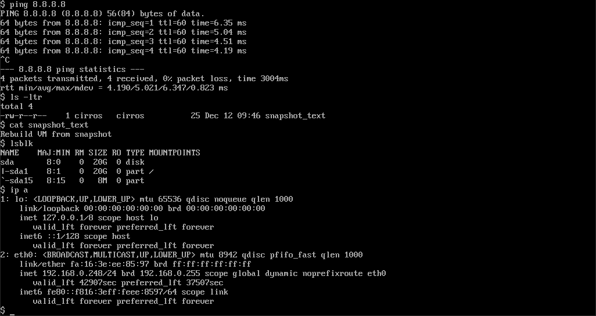
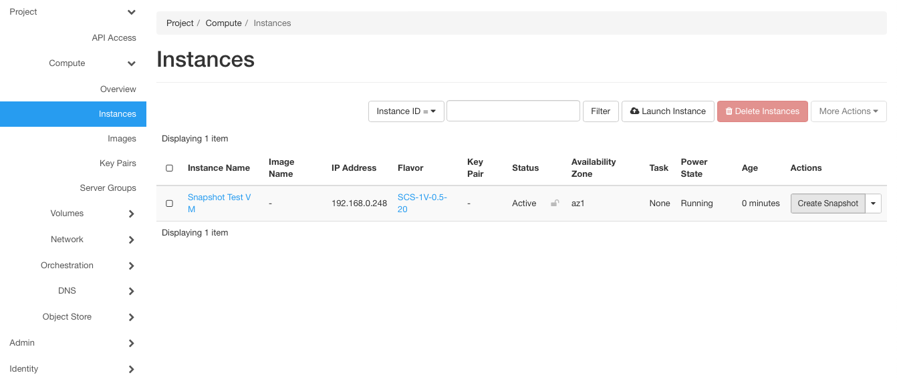
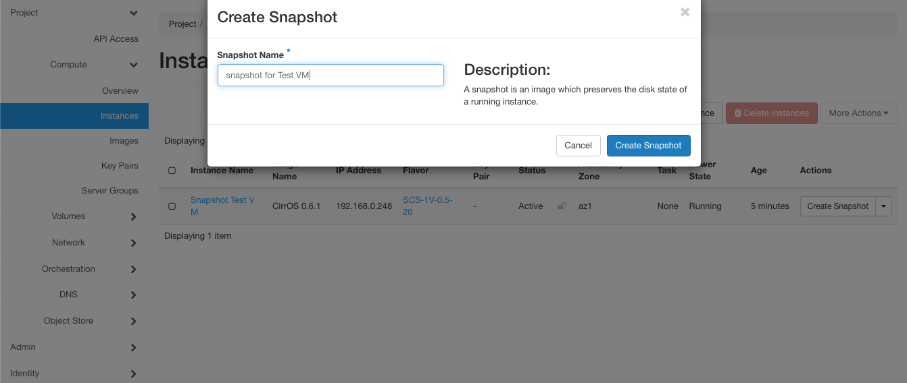
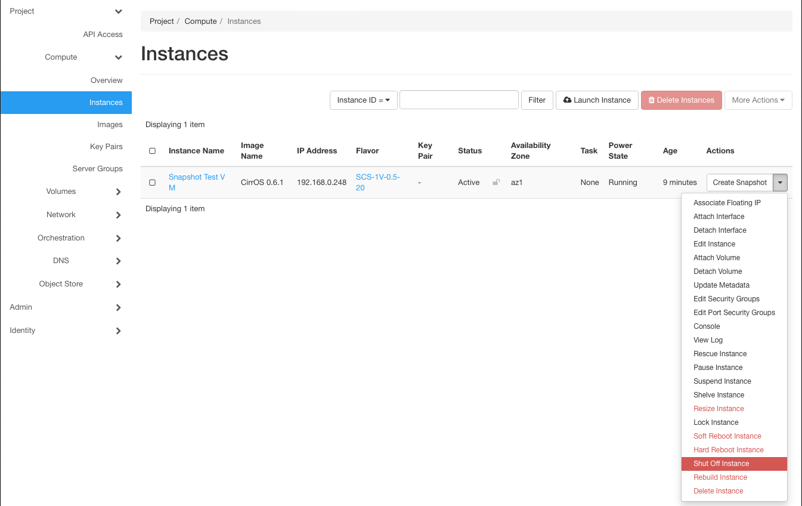
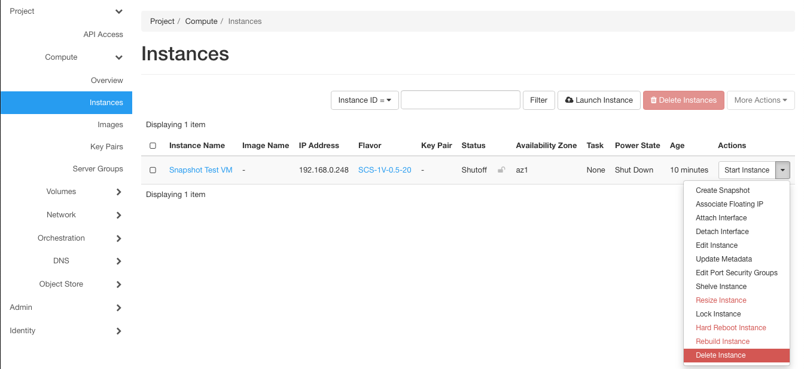
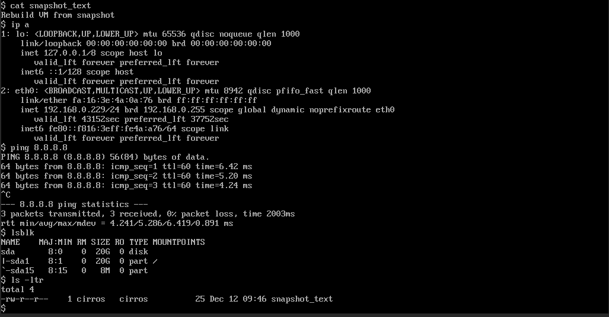

---
#https://gohugo.io/content-management/page-bundles/
title: "Rebuild an Instance from a Snapshot"
type: "docs"
date: 2023-07-26
description: >
  Create a Snapshot from your VM, delete it, and rebuild it again
---

## Overview

The scope of this document is to enable users to create a snapshot from an existing vm, delete the vm to remove it from pluscloud open and rebuild the vm again from the snapshot taken earlier. Pre- and post-checks should be done by the user before and after this procedure where needed. 

Note: VM tends to pickup different IPs if not assigned statically. The floating IPs will be detached from VM but they will remained assigned to port in the project.  The floating IPs are billed as long as they are part of the project they need to be removed from the project if not desired.

## Pre-Checks from the User

Please do check below items (you need to know them to rebuild the VM afterwards) before executing the procedure. The pre-checks may extend beyond below items depending on the vm type.

* Attached Networks 
* Network Reachability
* Mounted storages
* Application status

## Snapshot creation and verification

Login to your project and check the vm you want to snapshot. Under the actions tab use "Create Snapshot" to open the snapshot menu. 

In the opening dialogue enter a name for the snapshot and afterwards click "Create Snapshot":

After the snapshot has been created, it should show up under the **Snapshots** tab:

## VM deletion

As you have now successfully taken a snapshot of your vm, you can power off your vm 

and delete it:

## VM rebuild from Snapshot

To rebuild the VM from the snapshot, select "Launch as Instance" from **Actions" menue under the snapshots tab:

You have to go through the "Launch Instance" menu again and provide the neccessary details to create a new instance from your snapshot:

## Post-Checks from the User

Please check, whether all properties of your VM have been rebuild regarding the items below:

* Attached Networks 
* Network Reachability
* Mounted storages
* Application status

