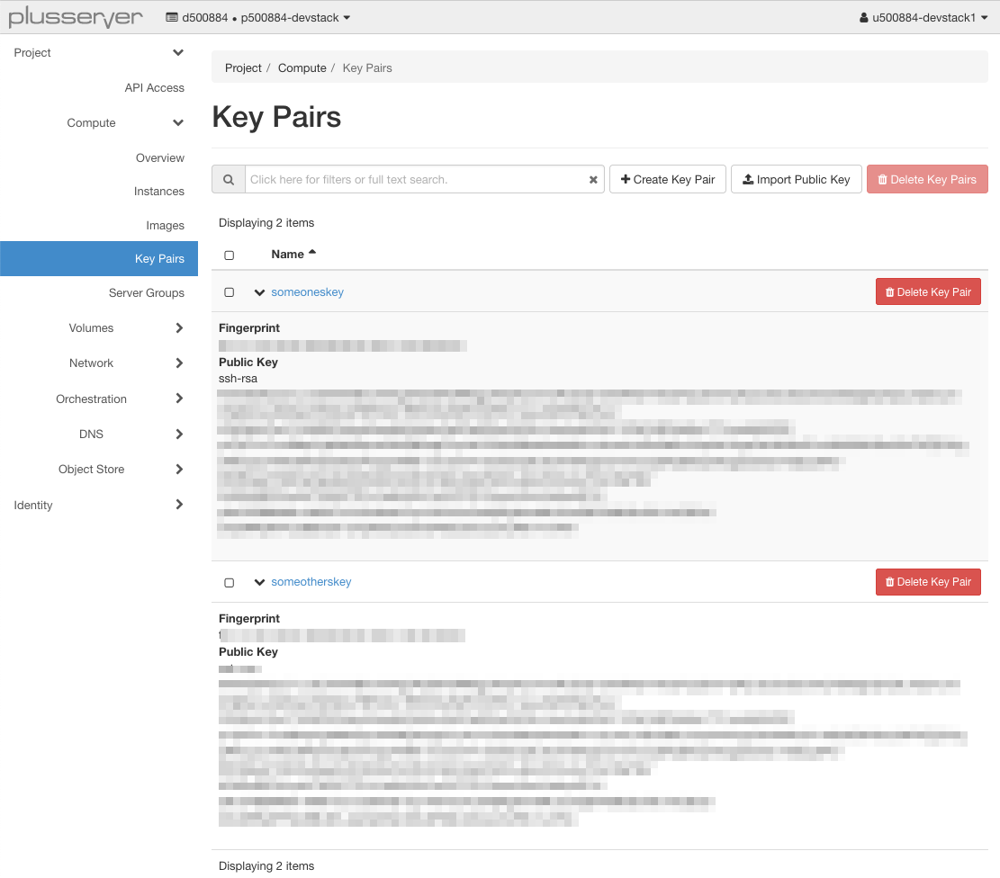

## What is Terraform?

Terraform is an infrastructure as code tool that lets you build, change, and version infrastructure safely and efficiently. This includes low-level components like compute instances, storage, and networking, as well as high-level components like DNS entries and SaaS features.

[Ausführliche Dokumentation](https://developer.hashicorp.com/terraform/docs)

Terraform has changed its license model in 2023 if you want to work with an open source license you have to use the official open source fork [OpenTofu](https://opentofu.org/). We will provide a separate [OpenTofu Tutorial](../../opentofu/) shortly.

## Basic Terraform overview

1. Create a description of your infrastructure
You describe your infrastructure at Terraform with the [HCL](https://developer.hashicorp.com/terraform/language/syntax/configuration). This results in several files that are best organized as follows

   * main.tf: In this file you describe in the HCL syntax the providers to be installed and the backend you want to use.
   
      ```go
      terraform {
         required_providers {
            openstack = {
               source = "terraform-provider-openstack/openstack"
               version = ">= 1.54.1"
            }
         }
         backend "s3" {}
      }
      ```

      Here it is described that the Openstack Provider should be installed in version 1.54.1 or higher.
      In addition, it is defined that the [s3 backend](../backend/) is to be used for the Terraform status files.

   * provider.tf: In this file you describe the configuration of the individual providers

      ```go
      provider "openstack" {
         cloud = "openstack"
      }
      ```

      It is defined that the cloud with the name *openstack* is to be used from [clouds.yaml](/de/compute/pluscloudopen/introduction/environments/#anmeldeinformationen-für-cli-tools).

   * resources.tf: In this file you describe the individual resources that are to be created.

      ```go
      // Push keypairs
      resource "openstack_compute_keypair_v2" "keypairs" {
         for_each = var.ssh_pub_keys
         name = each.key
         public_key = each.value
      }
      ```

      We have defined here that a list of public ssh keys is stored in the Openstack. These keys can later be used to access the servers/instances

   * variables.tf: In this file you describe the variables that are used in the other files.

      ```go
      // Push keypairs
      variable "ssh_pub_keys" {
         description = "key_name = ssh public key"
         type        = map(string)
         default     = {}
      }
      ```

      Here we describe a variable in which we specify that a list of key-value pairs defines our ssh keys.

   * terraform.tfvars: In this file you define the content of the variables described in variables.tf.

      ```go
      ssh_pub_keys = {
         someoneskey = "ssh-rsa AAAAB............JrLR8vT+oTM=",
         someotherskey = "ssh-rsa AAAAC............dfoe03Tfde+2="
      }
      ```

      In this case, we now set two ssh keys in our variable.

2. Initialize the Terraform working directory

   ```bash
   > terraform init
   ```

3. Plan your infrastructure

   ```bash
   > terraform plan
   ```

4. Apply your Terraform code

   ```bash
   > terraform apply
   ```

   The result then looks like this in Horizon

   

5. Delete your infrastructure again

   ```bash
   > terraform destroy
   ```