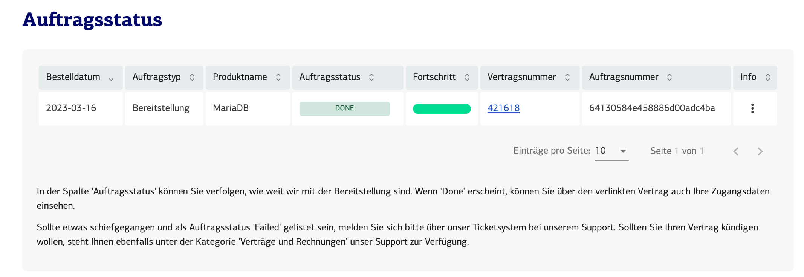

# Bestellung
Sie benötigen schnell eine Datenbank? Dann führen wir Sie hier durch die Bestellung:

### Kundenportal
Sie starten immer in unserem [Kundenportal](https://customerservice.plusserver.com)

### Auswahl DBaaS
Navigieren Sie zunächst zu ***Cloud Services / Datenbanken***

### Auswahl DBaaS
Wählen Sie die benötigte Datenbank aus

### Auswahl Nodesize
Wählen Sie nun die Größe bzw. Leistungsfähigkeit aus. Sie wissen noch nicht welche Leistung Sie benötigen? Dann wählen Sie die kleinste Node und skallieren bei Bedarf später

### Auswahl der Speichergröße
Sie starten immer mit mindestens 50GB Speicher für Ihre Daten. 

### Freischalten des Zugriffs
Der Service ist über eine öffentliche IP erreichbar. Da diese frei aus dem Internet verfügbar ist und potentiell jedem "angegriffen" werden könnte, sperren wir intial jeglichen Zugriff auf den Service. Der reine Schutz durch eine verschlüsselte Verbindung mit Benutzername und Passwort ist nicht ausreichend. Deswegen muss dediziert angegeben werden, von welchen vertrauenswürdigen Quellen die DBaaS zugreifbar sein soll
Sie müssen hier den Zugriff von einer oder mehrer externen Adressen oder Adressbereichen freischalten. Idealerweise ist hier nur die eine IP freigegeben, von der der Service genutzt wird.

### Auswahl der Region

Sie können hier auswählen in welcher [Region](https://docs.xaas.get-cloud.io/docs/01-dbaas/02-faq/#Regions) der Service bereitgestellt werden soll. 

### Auswahl des Rechnungsprofils
Sie sind neuer Kunde bei Plusserver und bekommen noch keine Rechnung? Dann wählen Sie ***Neues Rechnungsprofil***. Sind Sie bereits Kunde: Dann können Sie aus bereits bestehenden Rechnungsprofilen wählen und bekommen den neuen DBaaS mit auf eine bestehende Rechnung, diese müssen Sie dann auswählen. 

### Auslösen der Bestellung
Prüfen Sie bitte über die Zusammenfassung Ihre eingegeben Daten. Lesen Sie bitte die Bestimmungen und Vereinbarungen und bestätigen diese. Erst danach können Sie die Bestellung mit dem Kopf ***jetzt kostenpflichtig bestellen*** abschließen

### Bestellstatus verfolgen
Direkt nach der Bestellung werden Sie auf den [Bestellstatus](https://customerservice.plusserver.com/order-status) weitergeleitet. Sie können hier jederzeit den Status laufender Aufträge einsehen.

* new: Status direkt nach dem Auftrag
* processing: Status sobald die automatische Bereitstellung angelaufen ist
* failed: Es ist leider etwas schiefgegangen, bitte öffnen Sie ein [Ticket](https://customerservice.plusserver.com/support/ticket-create) hier im Portal, so dass wir Ihnen schnellstmöglich helfen können.
* DONE: Herzlichen Glückwunsch, Ihr neuer DBaaS steht zur Verfügung

### Zugangsdaten einsehen
Direkt nach der Bestellung können Sie vom Auftrag aus direkt zum Vertrag springen. Dort finden Sie die Zugangsdaten.
Sie können die Zugangsdaten aber auch jederzeit über die [Verträge](https://customerservice.plusserver.com/billing/contracts) finden. Mehr Details finden Sie in dieser [Anleitung](https://docs.xaas.get-cloud.io/de/docs/01-dbaas/03-howto/zugangsdaten).

### Erste Schritte mit dem Service
Schauen Sie hier bitte in unsere Anleitungsartikel
* [Zur Datenbank verbinden](https://docs.xaas.get-cloud.io/docs/01-dbaas/03-howto/verbindung-zur-datenbank/)
* [User und Passworte anlegen]([https://docs.xaas.get-cloud.io/de/docs/01-dbaas/03-howto/anlegen-neuer-datenbanken-und-user](https://docs.xaas.get-cloud.io/docs/01-dbaas/03-howto/anlegen-neuer-datenbanken-und-user/))

# Anpassung
Feature kommt in Q2 2023

# Kündigung
Feature kommt im April 2023
